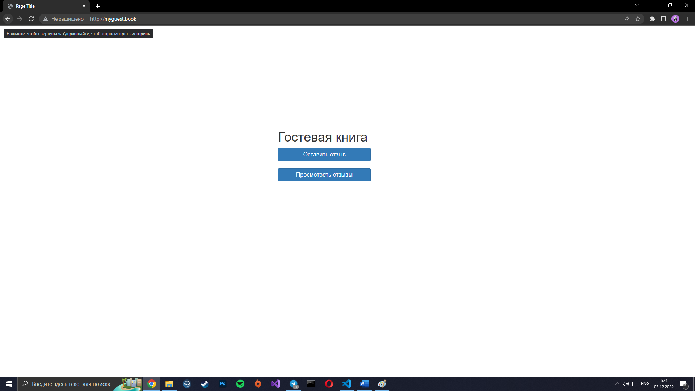

<h2 style="text-align: center; margin-top: 100px;font-size:40px">Лабораторная работа №9</h2>
<h2 style="text-align: center; margin-top:10px">Разработка серверных скриптов</h2>
<h3 style="text-align: right; margin-top:400px">Выполнил студент 3 курса   Чагочкин Никита</h3>
<h3 style="text-align: center; margin-top:40px">Южно-Сахалинск  2022 г. </h3>

- - -

## Решение:
        <h4>Задание 1</h4>
    <?php
    $now = time();
    $currentYear=date('Y');
    $newYear = mktime(0, 0, 0, 1, 1, $currentYear + 1);
    $day = floor(($newYear - $now) / 60 / 60 / 24);
    echo 'Дней до нового года : ' . $day;
    ?>
    <h4>Задание 2</h4>
    <?php
    if (isset($_REQUEST['year'])) {
        $year = $_REQUEST['year'];
        if (($year % 4 == 0 and $year % 100 != 0) or $year % 400 == 0) {
            echo $year . ' год високосный!';
        } else {
            echo $year . ' год невисокосный!';
        }
    }
    unset($_GET);
    ?>
    <form action="" method="get">
        
Введите год

        <input type="text" name="year" placeholder="">  
        <input type="submit">
    </form>
    <h4>Задание 3</h4>
    <?php
    if (isset($_REQUEST['date'])) {
        $date = explode('.', $_REQUEST['date']);
        $week = ['Воскресенье', 'Понедельник', 'Вторник', 'Среда', 'Четверг', 'Пятница', 'Суббота'];
        echo $week[date('w', mktime(0, 0, 0, $date[1], $date[0], $date[2]))];
    }
    ?>
    <form action="" method="get">
        
Введите дату в формате '01.12.1990'.

        <input type="text" name="date" placeholder="">  
        <input type="submit">
    </form>
    <h4>Задание 4</h4>
    <?php
    $week = ['Воскресенье', 'Понедельник', 'Вторник', 'Среда', 'Четверг', 'Пятница', 'Суббота'];
    $month = [1=>'Января', 'Февраля', 'Марта', 'Апреля', 'Мая', 'Июня', 'Июля', 'Августа', 'Сентября', 'Октября', 'Ноября', 'Декабря'];
    $now = time();
    $date = explode('-', date('d-n-Y', $now));
    echo $date[0].' '.$month[$date[1]].' '.$date[2].', '.$week[date('w', $now)];
    ?>
    <h4>Задание 5</h4>
    <?php
    if (isset($_REQUEST['task5'])) {
        $date = explode('.', $_REQUEST['task5']);
        $now = time();
        $dr = mktime(23, 59, 59, $date[1], $date[0]) + 1;
        if ($dr > $now) {
            echo "До дня рождения".floor(($dr - $now) / 60 / 60 / 24) . ' days';
        } else {
            echo "До дня рождения".floor(($dr - $now + 60 * 60 * 24 * 365) / 60 / 60 / 24) . ' days';
        }
    }
    ?>
    <form action="" method="get">
        
Введите дату рождения в формате '01.12.1990'.

        <input type="text" name="task5" placeholder="">
        <input type="submit">
    </form>
    <h4>Задание 6</h4>
    <?php
    $lastSn = 0;
    $now = time();
    for ($i = 28; $i >= 1; $i--) {
        if (date('w', mktime(0, 0, 0, 2, $i)) == 0) {
            $lastSn = mktime(23, 59, 59, 2, $i) + 1;
            break;
        }
    }
    if ($lastSn > $now) {
        echo "до ближайшей масленницы ".floor(($lastSn - $now) / 60 / 60 / 24) . ' days';
    } else {
        echo "до ближайшей масленницы ".floor(($lastSn - $now + 60 * 60 * 24 * 365) / 60 / 60 / 24) . ' days';
    }
    ?>
    <h4>Задание 7</h4>
    <?php
    if (isset($_REQUEST['task7'])) {
        $date = explode('.', $_REQUEST['task7']);
        $dateStr = $date[1].$date[0];
        if ($dateStr >= '0321' and $dateStr <= '0419') {
            echo 'Овен';
        }
        if ($dateStr >= '0420' and $dateStr <= '0520') {
            echo 'Телец';
        }
        if ($dateStr >= '0521' and $dateStr <= '0620') {
            echo 'Близнецы';
        }
        if ($dateStr >= '0621' and $dateStr <= '0722') {
            echo 'Рак';
        }
        if ($dateStr >= '0723' and $dateStr <= '0822') {
            echo 'Лев';
        }
        if ($dateStr >= '0823' and $dateStr <= '0922') {
            echo 'Дева';
        }
        if ($dateStr >= '0923' and $dateStr <= '1022') {
            echo 'Весы';
        }
        if ($dateStr >= '1023' and $dateStr <= '1121') {
            echo 'Скорпион';
        }
        if ($dateStr >= '1122' and $dateStr <= '1221') {
            echo 'Стрелец';
        }
        if (($dateStr >= '1222' and $dateStr <= '1231') or ($dateStr >= '0101' and $dateStr <= '0119')) {
            echo 'Козерог';
        }
        if ($dateStr >= '0120' and $dateStr <= '0218') {
            echo 'Водолей';
        }
        if ($dateStr >= '0219' and $dateStr <= '0320') {
            echo 'Рыбы';
        }
    }
    ?>
    <form action="" method="get">
        
Введите дату рождения в формате '31.12'.

        <input type="text" name="task7" placeholder="">
        <input type="submit">
    </form>
    <h4>Задание 8</h4>
    <?php
    $prazd = [
        '0212' => 'День банковского работника России',
        '0312'=>'Международный день инвалидов',
        '0412'=>'День Пермского края'
    ];
    $date = date('dm', time());
    if (array_key_exists($date, $prazd)) {
        echo "Сегодня ".$prazd[$date]." Поздравляю!!!";
    }
    ?>
    <h4>Задание 7</h4>
    <?php
    if (isset($_REQUEST['task9'])) {
        
        $date = explode('.', $_REQUEST['task9']);
        $dateStr = $date[1].$date[0];
        if ($dateStr >= '0321' and $dateStr <= '0419') {
            $znak= 'Овен';
        }
        if ($dateStr >= '0420' and $dateStr <= '0520') {
            $znak='Телец';
        }
        if ($dateStr >= '0521' and $dateStr <= '0620') {
            $znak= 'Близнецы';
        }
        if ($dateStr >= '0621' and $dateStr <= '0722') {
            $znak= 'Рак';
        }
        if ($dateStr >= '0723' and $dateStr <= '0822') {
            $znak='Лев';
        }
        if ($dateStr >= '0823' and $dateStr <= '0922') {
            $znak='Дева';
        }
        if ($dateStr >= '0923' and $dateStr <= '1022') {
            $znak= 'Весы';
        }
        if ($dateStr >= '1023' and $dateStr <= '1121') {
            $znak= 'Скорпион';
        }
        if ($dateStr >= '1122' and $dateStr <= '1221') {
            $znak= 'Стрелец';
        }
        if (($dateStr >= '1222' and $dateStr <= '1231') or ($dateStr >= '0101' and $dateStr <= '0119')) {
            $znak= 'Козерог';
        }
        if ($dateStr >= '0120' and $dateStr <= '0218') {
            $znak= 'Водолей';
        }
        if ($dateStr >= '0219' and $dateStr <= '0320') {
            $znak= 'Рыбы';
        }
        $goroskop = [
            'Овен' => 'Сегодня вам повезет',
            'Телец' => 'Сегодня вам повезет',
            'Близнецы' => 'Сегодня вам повезет',
            'Рак' => 'Сегодня вам повезет',
            'Лев' => 'Сегодня вам повезет',
            'Дева' => 'Сегодня вам повезет',
            'Весы' => 'Сегодня вам повезет',
            'Скорпион' => 'Сегодня вам повезет',
            'Стрелец' => 'Сегодня вам повезет',
            'Козерог' => 'Сегодня вам повезет',
            'Водолей' => 'Сегодня вам повезет',
            'Рыбы' => 'Сегодня вам повезет'
        ];
        echo 'Ваш знак зодиака'.$znak.' Гороскоп: '.$goroskop[$znak];
    }
    ?>
    <form action="" method="get">
        
Введите дату рождения в формате '31.12'.

        <input type="text" name="task9" placeholder="">
        <input type="submit">
    </form>
    <h4>Задание 10</h4>
    <?php
    if (!empty($_REQUEST['task10'])) {
        $str = $_REQUEST['task10'];
        $strLen = strlen($str);
        $wordsCount = count(explode(' ', $str));
        $spaceCount = $wordsCount - 1;
        echo 'В тексте '.$wordsCount.' слов, '.$strLen.' символов, '.$spaceCount . ' пробелов.';
    }
    ?>
    <form action="" method="get">
        <textarea name="task10" placeholder="">Введите текст</textarea>
        <input type="submit">
    </form>
    <h4>Задание 11</h4>
    <?php
    mb_internal_encoding("UTF-8");
    if (!empty($_REQUEST['task11'])) {
        $str = $_REQUEST['task11'];
        $strLen = mb_strlen($str);
        $valuesCount = array_count_values(str_split($str));
        foreach ($valuesCount as $key => $item) {
            $x = 100 / $strLen * $item;
            echo '"'.$key.'" - "'.round($x, 2).'" ';
        }
    }
    ?>
    <form action="" method="post">
        <textarea name="task11" placeholder="">Press button====>></textarea>
        <input type="submit">
    </form>
    <h4>Задание 12</h4>
    <?php
    $words = ['hello', 'friend', 'world', 'house', 'auto', 'russia', 'football', 'england', 'php' ,'привет','друг','мир','дом','автомобиль','россия','футбол','англия','змея','цапля'];
    if (isset($_REQUEST['task12'])) {
        $char = str_split($_REQUEST['task12']);
        $wordsNew = [];
        $kol = count($char);
        foreach ($words as $word) {
            $k = true;
            for ($i = 0; $i < $kol; $i++) {
                if (!strpbrk($word, $char[$i])) {
                    $k = false;
                }
            }
            if ($k) {
                $wordsNew[] = $word;
            }
        }
        foreach ($wordsNew as $word) {
            echo $word.' ';
        }
    }
    ?>
    
Введите 1 букуву

    <form action="" method="post">
        <input type="text" name="task12" placeholder="">
        <input type="submit">
    </form>
    <h4>Задание 13</h4>
    <?php
    if (isset($_REQUEST['task13'])) {
        $abv = ['а', 'б', 'в', 'г', 'д', 'е', 'ё', 'ж', 'з', 'и', 'й', 'к', 'л', 'м',
            'н', 'о', 'п', 'р', 'с', 'т', 'у', 'ф', 'х', 'ц', 'ч', 'ш', 'щ', 'ы', 'э', 'ю', 'я'];
        $words = explode(' ', $_REQUEST['task13']);
        $res = [];
        foreach ($abv as $item) {
            foreach ($words as $word) {
                $word = mb_strtolower($word);
                if (mb_substr($word, 0, 1) == $item) {
                    $res[$item][] = $word;
                }
            }
        }
        foreach ($res as $key => $item2) {
            echo 'Слова на букву '.$key.' ';
            foreach ($item2 as $subItem) {
                echo $subItem.' ';
            }
            echo ' ';
        }

    }
    ?>
    <form action="" method="post">
        <textarea name="task13">Алфавит все слова по порядку</textarea>
        <input type="submit">
    </form>
    <h4>Задание 15</h4>
    <?php
    mb_internal_encoding("UTF-8");
    if (isset($_REQUEST['task15'])) {
        $translit = [
            'а' => 'a', 'б' => 'b', 'в' => 'v', 'г' => 'g', 'д' => 'd',
            'е' => 'e', 'ё' => 'yo', 'ж' => 'zh', 'з' => 'z', 'и' => 'i',
            'й' => 'y', 'к' => 'k', 'л' => 'l', 'м' => 'm', 'н' => 'n',
            'о' => 'o', 'п' => 'p', 'р' => 'r', 'с' => 's', 'т' => 't',
            'у' => 'u', 'ф' => 'f', 'х' => 'kh', 'ц' => 'ts', 'ч' => 'ch',
            'ш' => 'sh', 'щ' => 'shch', 'ъ' => '-', 'ы' => 'y', 'ь' => '`',
            'э' => 'e', 'ю' => 'yu', 'я' => 'ya', ' ' => ' '
        ];
        $str = mb_strtolower($_REQUEST['task15']);
        if ($_REQUEST['translit'] == 1) {
            foreach ($translit as $key => $item) {
                $str = str_replace($key, $item, $str);
            }
        }
        if ($_REQUEST['translit'] == 2) {
            foreach ($translit as $key => $item) {
                $str = str_replace($item, $key, $str);
            }
        }
        echo $str;
    }
    ?>
    <form action="" method="get">
        <input type="radio" name="translit" value="1" checked placeholder=""> с русского  
        <input type="radio" name="translit" value="2" placeholder=""> на русский  
        <input type="text" name="task15" placeholder=""> Введите текст 
        <input type="submit">
    </form>
    <h4>Задание 16</h4>
    <button type="submit" onClick="location.href='http://lab9.localhost/Task16.php'">Задание 16</button> 
    </form>
    <h4>Задание 17</h4>
    <button type="submit" onClick="location.href='http://lab9.localhost/Task17.php'">Задание 17</button> 
    <h4>Задание 18</h4>
    <button type="submit" onClick="location.href='http://lab9.localhost/Task18.php'">Задание 18</button> 
    <h4>Задание 19</h4>
    <?php
    if (isset($_REQUEST['task19'])) {
        $num = $_REQUEST['task19'];
        $arr = range(1, $num);
        $fak = array_product($arr);
        echo $fak;
    }
    ?>
    <form action="" method="post">
        <input type="text" name="task19" placeholder="">Факториал числа  
        <input type="submit">
    </form>
    <h4>Задание 20</h4>
    <?php
    if (isset($_REQUEST['a']) and isset($_REQUEST['b']) and $_REQUEST['c']) {
        $a = $_REQUEST['a'];
        $b = $_REQUEST['b'];
        $c = $_REQUEST['c'];
        $d = $b * $b - 4 * $a * $c;
        $x1 = round((-$b + sqrt($d)) / (2 * $a), 2);
        $x2 = round((-$b - sqrt($d)) / (2 * $a), 2);
        echo 'x1 = '.$x1.', x2 = '.$x2;
    }
    ?>

    <form action="" method="post">
        
Введите коэффициенты

        <input type="text" name="a" placeholder="">A 3  
        <input type="text" name="b" placeholder="">B -14  
        <input type="text" name="c" placeholder="">C -5  
        <input type="submit">
    </form>
    <h4>Задание 21</h4>
    <?php
    if (isset($_REQUEST['a2']) and isset($_REQUEST['b2']) and $_REQUEST['c2']) {
        $arr[] = $_REQUEST['a2'] * $_REQUEST['a2'];
        $arr[] = $_REQUEST['b2'] * $_REQUEST['b2'];
        $arr[] = $_REQUEST['c2'] * $_REQUEST['c2'];
        sort($arr);
        if ($arr[2] == $arr[1] + $arr[0]) {
            echo 'True';
        } else {
            echo 'False';
        }
    }
    ?>

    <form action="" method="post">
        
Введите числа

        <input type="text" name="a2" placeholder="">  
        <input type="text" name="b2" placeholder="">  
        <input type="text" name="c2" placeholder="">  
        <input type="submit">
    </form>

    <h4>Задание 22</h4>
    <?php
    if (isset($_REQUEST['task22'])) {
        $num = $_REQUEST['task22'];
        $del = [];
        for ($i = 1; $i <= $num; $i++) {
            if ($num % $i == 0) {
                $del[] = $i;
            }
        }
        $str = implode(', ', $del);
        echo 'Делители числа: '.$str;
    }
    ?>
    <form action="" method="post">
        
Введите число

        <input type="text" name="task22" placeholder="">  
        <input type="submit">
    </form>

    <h4>Задание 23</h4>
    <?php
    function mnozhitel($num, $x)
    {
        return $num % $x == 0;
    }

    function prostoy($x)
    {
        $kol = 0;
        for ($i = 1; $i < $x; $i++) {
            if ($x % $i == 0) {
                $kol++;
                if ($kol > 1) {
                    break;
                }
            }
        }
        if ($kol == 1) {
            return true;
        } else {
            return false;
        }
    }

    function razdelenie($num)
    {
        for ($i = 2; $i <= $num; $i++) {
            if (mnozhitel($num, $i)) {
                if (prostoy($i)) {
                    global $arr;
                    razdelenie($num / $i);
                    $arr[] = $i;
                    break;
                }
            }
        }
    }

    if (isset($_REQUEST['task23'])) {
        $num = $_REQUEST['task23'];
        $arr = [];
        if (prostoy($num)) {
            echo 'Вы ввели простое число';
        } else {
            razdelenie($num);
        }
        echo 'Множетели числа: '.implode(', ', array_reverse($arr));
    }
    ?>
    <form action="" method="post">
        
Введите число

        <input type="text" name="task23" placeholder="">  
        <input type="submit">
    </form>

    <h4>Задание 24</h4>
    <?php
    function deliteli($num)
    {
        $del = [];
        for ($i = 1; $i <= $num; $i++) {
            if ($num % $i == 0) {
                $del[] = $i;
            }
        }
        return $del;
    }
    if (isset($_REQUEST['a24']) and isset($_REQUEST['b24'])) {
        $a = $_REQUEST['a24'];
        $b = $_REQUEST['b24'];
        $delA = deliteli($a);
        $delB = deliteli($b);
        $str = implode(', ', array_intersect($delA, $delB));
        echo 'Общие делители: '.$str;
    }
    ?>
    <form action="" method="post">
        
Введите числа

        <input type="text" name="a24" placeholder="">  
        <input type="text" name="b24" placeholder="">  
        <input type="submit">
    </form>

    <h4>Задание 25</h4>
    <?php
    if (isset($_REQUEST['a25']) and isset($_REQUEST['b25'])) {
        $a = $_REQUEST['a25'];
        $b = $_REQUEST['b25'];
        $delA = deliteli($a);
        $delB = deliteli($b);
        $del = array_intersect($delA, $delB);
        echo 'нод чисел - '.max($del);
    }
    ?>
    <form action="" method="post">
        
Введите числа

        <input type="text" name="a25" placeholder="">  
        <input type="text" name="b25" placeholder="">  
        <input type="submit">
    </form>

    <h4>Задание 26</h4>
    <?php
    if (isset($_REQUEST['a26']) and isset($_REQUEST['b26'])) {
        $a = $_REQUEST['a26'];
        $b = $_REQUEST['b26'];
        $max = 0;
        if ($a > $b) {
            $max = $a;
        } else {
            $max = $b;
        }
        $flag = true;
        while ($flag) {
            $max++;
            if ($max % $a == 0 and $max % $b == 0) {
                $flag = false;
                echo 'Нок чисел - '.$max;
            }
        }
    }
    ?>
    <form action="" method="post">
        
Введите числа

        <input type="text" name="a26" placeholder="">  
        <input type="text" name="b26" placeholder="">  
        <input type="submit">
    </form>

    <h4>Задание 27</h4>
    <button type="submit" onClick="location.href='http://lab9.localhost/Task27.php'">Задание 27</button> 

## Гостевая книга

### Index
    <!DOCTYPE html>
    <html>

    <head>
        <meta charset='utf-8'>
        <meta http-equiv='X-UA-Compatible' content='IE=edge'>
        <title>Page Title</title>
        <meta name='viewport' content='width=device-width, initial-scale=1'>
        <link href="https://maxcdn.bootstrapcdn.com/bootstrap/3.3.7/css/bootstrap.min.css" rel="stylesheet" />
        
    </head>

    <body>
        <h1 style="margin-top:15%; margin-left: 40%; margin-right: auto;  width: 20em">Гостевая книга</h1>
        <button style="margin-left: 40%; font-size: medium;   width: 16em" type="submit" class="btn btn-sm btn-primary" onClick="location.href='http://myguest.book/send.php'">Оставить отзыв</button>
         
         
        <button style="margin-left: 40%; font-size: medium;   width: 16em" type="submit" class="btn btn-sm btn-primary" onClick="location.href='http://myguest.book/show.php'">Просмотреть отзывы</button> 
    </body>

    </html>
### Форма для отправки
    <!DOCTYPE html>
    <html>
    <head>
        <meta charset="utf-8" />
        <meta name="viewport" content="width=device-width" />
        <title>Оставтье отзыв</title>
        <link href="https://maxcdn.bootstrapcdn.com/bootstrap/3.3.7/css/bootstrap.min.css" rel="stylesheet" />
        
    </head>
    <body>
        <h2>Оставтье отзыв</h2>
        <form action="sender.php" method="post" style="margin-left:10px; margin-right:10px">    
            <label for="name">Username:</label>
            <input class="form-control" name="username" />
            
            <label for="email">Email:</label>
            <input class="form-control" name="email" />
        
            <label for="homepage">HomePage:</label>
            <input class="form-control" name="homepage" />
        
            <label for="message">Message:</label>
            <textarea class="form-control" name="message">text</textarea>
                
            

            <button style="margin-top:5px; " class="btn btn-sm btn-primary" type="submit" name="submit" >Отправить</button> 
        </form> 
        </body>
    </html>
### Отправка данных
    <?php
    $conn = new mysqli("localhost", "root", "root","messages");
    if($conn->connect_error){
        die("Ошибка: " . $conn->connect_error);
    }

    $UserName = strip_tags($_POST["username"]);
    $Email = strip_tags($_POST["email"]);
    $Homepage = strip_tags($_POST["homepage"]);
    $Text = strip_tags($_POST["message"]);

    //ip
    $ip = $_SERVER['REMOTE_ADDR'];
    function getIp() {
    $keys = [
        'HTTP_CLIENT_IP',
        'HTTP_X_FORWARDED_FOR',
        'REMOTE_ADDR'
    ];
    foreach ($keys as $key) {
        if (!empty($_SERVER[$key])) {
        $ip = trim(end(explode(',', $_SERVER[$key])));
        if (filter_var($ip, FILTER_VALIDATE_IP)) {
            return $ip;
        }
        }
    }
    }

    $ip = getIp();
    //Browser
    $user_agent = $_SERVER["HTTP_USER_AGENT"];
    if (strpos($user_agent, "Firefox") !== false) $browser = "Firefox";
    elseif (strpos($user_agent, "Opera") !== false) $browser = "Opera";
    elseif (strpos($user_agent, "Chrome") !== false) $browser = "Chrome";
    elseif (strpos($user_agent, "MSIE") !== false) $browser = "Internet Explorer";
    elseif (strpos($user_agent, "Safari") !== false) $browser = "Safari";
    else $browser = "Неизвестный";
    //Дата
    $date = date("m.d.y");
    //Отправляем в таблицу
    $result = $conn->query("INSERT INTO `allmess` (`username`, `email`, `homepage`, `text`, `ip`, `browser`, `date`) VALUES ('$UserName', '$Email', '$Homepage', '$Text','$ip','$browser','$date');");
    ?>
    <link href="https://maxcdn.bootstrapcdn.com/bootstrap/3.3.7/css/bootstrap.min.css" rel="stylesheet" />
    <h2 style="margin-top:15%; margin-left: 40%; margin-right: auto;  width: 20em">Сообщение отправлено</h2>
    <button style="margin-left: 40%; font-size: medium;   width: 21em" type="submit" class="btn btn-sm btn-primary" onClick="location.href='http://myguest.book'">На главную</button>

### Вывод таблицы
    <!DOCTYPE html>
    <html>
    <head>
        <meta charset="utf-8" />
        <meta name="viewport" content="width=device-width" />
        <title>Все сообщения</title>
        <link href="https://maxcdn.bootstrapcdn.com/bootstrap/3.3.7/css/bootstrap.min.css" rel="stylesheet" />
    </head>
    <body>
        <h2>Все сообщения</h2>
        <?php
        $conn = new mysqli("localhost", "root", "root", "messages");
        if($conn->connect_error){
        die("Ошибка: " . $conn->connect_error);
        }
        $sql = "SELECT * FROM allmess";
        if($result = $conn->query($sql)){
        $rowsCount = $result->num_rows; // количество полученных строк
        echo "
Получено объектов: $rowsCount
";
        echo "<table class='table table-condensed table-striped table-bordered'>
        <tr><th>UserName</th><th>Email</th><th>Homepage</th><th>Message</th><th>Ip</th><th>Browser</th><th>Date</th></tr>";
        foreach($result as $row){
            echo "<tr>";
                echo "<td>" . $row["username"] . "</td>";
                echo "<td>" . $row["email"] . "</td>";
                echo "<td>" . $row["homepage"] . "</td>";
                echo "<td>" . $row["text"] . "</td>";
                echo "<td>" . $row["ip"] . "</td>";
                echo "<td>" . $row["browser"] . "</td>";
                echo "<td>" . $row["date"] . "</td>";
                
            echo "</tr>";
        }
        echo "</table>";
        $result->free();
        } else{
        echo "Ошибка: " . $conn->error;
        }
        $conn->close();
        ?>
        </body>
- - -